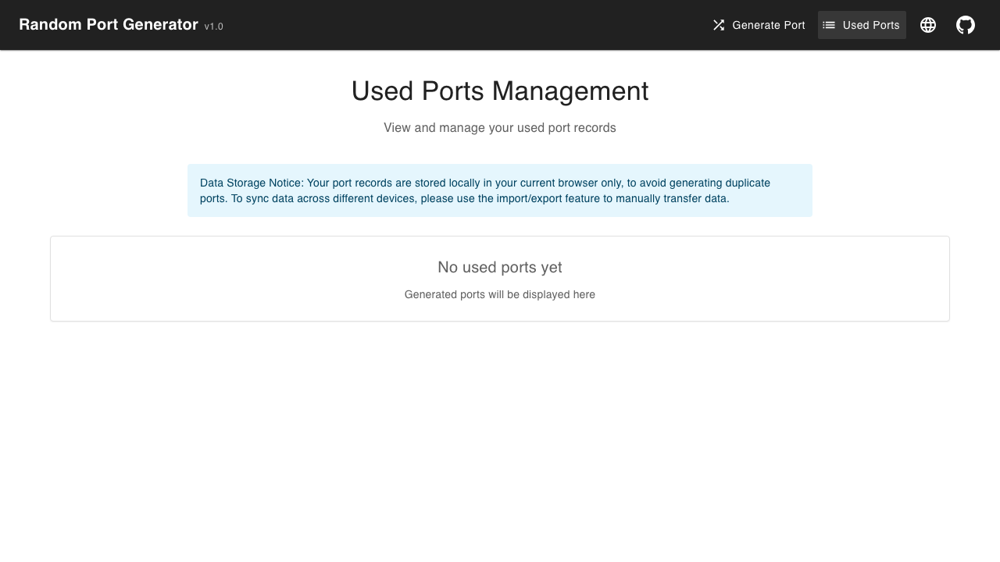

# 随机端口生成器

🇨🇳 中文版 | [🇺🇸 English](./README.md)

一个现代化、用户友好的随机端口生成器Web应用。使用React、TypeScript和Material-UI构建，支持中英文国际化。

## 🌟 功能特性

### 核心功能
- **随机端口生成**: 在自定义范围内生成1-1000个随机端口
- **智能端口范围选择**: 从预设范围中选择（系统端口、注册端口、动态端口、全部端口）
- **端口可用性检查**: 自动排除常用端口
- **批量生成**: 一次生成多个端口，智能去重

### 端口管理
- **已使用端口跟踪**: 自动保存和跟踪已使用的端口
- **搜索和筛选**: 按端口号搜索，按端口或时间排序
- **导入/导出**: 以JSON格式备份和恢复端口数据
- **本地存储**: 所有数据本地存储在IndexedDB中

### 用户体验
- **国际化**: 完整的中英文i18n支持
- **响应式设计**: 在桌面和移动设备上完美运行
- **现代主题**: 简洁、现代的Material-UI设计
- **一键复制**: 即时复制生成的端口到剪切板
- **实时更新**: 实时显示端口数量和可用性

## 🚀 在线演示

**🌐 [立即体验 GitHub Pages](https://cc11001100.github.io/rand-port/)**

## 📸 界面截图

### 英文界面

*Generate random ports with customizable settings*


*Manage and track your used ports*

### 中文界面

*生成随机端口 - 可自定义设置*


*管理和跟踪您的已使用端口*

## 🛠️ 技术栈

- **前端**: React 18 + TypeScript
- **UI框架**: Material-UI (MUI) v5
- **路由**: React Router v6
- **国际化**: react-i18next
- **数据存储**: IndexedDB（通过自定义服务）
- **构建工具**: Create React App
- **测试**: Playwright（E2E测试）

## 📦 安装和设置

### 环境要求
- Node.js 16+ 
- npm 或 yarn

### 快速开始
```bash
# 克隆仓库
git clone https://github.com/CC11001100/rand-port.git
cd rand-port

# 安装依赖
npm install

# 启动开发服务器
npm start

# 在浏览器中打开 http://localhost:3000
```

### 生产构建
```bash
# 创建生产构建
npm run build

# 本地服务（可选）
npm install -g serve
serve -s build
```

## 🎯 使用指南

### 生成端口

1. **设置端口范围**: 使用预设按钮或自定义滑块
   - **系统端口**: 1-1024（系统服务保留）
   - **注册端口**: 1024-49151（注册应用程序）
   - **动态端口**: 49152-65535（临时/私有使用）
   - **全部端口**: 1-65535（完整范围）

2. **选择数量**: 选择生成1-1000个端口

3. **生成**: 点击生成按钮创建随机端口

4. **使用结果**: 复制端口或标记为已使用

### 管理已使用端口

- **查看历史**: 查看所有之前使用的端口及时间戳
- **搜索**: 快速查找特定端口
- **排序**: 按端口号或使用时间排序
- **导出/导入**: 以JSON格式备份数据
- **删除**: 删除单个端口或清空所有数据

### 语言切换

点击导航栏中的语言图标（🌐）在以下语言间切换：
- 🇺🇸 **English**
- 🇨🇳 **简体中文**

您的语言偏好会自动保存和恢复。

## 🔧 开发

### 项目结构
```
src/
├── components/          # React组件
├── services/           # 数据服务（IndexedDB）
├── utils/              # 工具函数
├── types/              # TypeScript类型定义
├── i18n/               # 国际化
│   ├── index.ts        # i18n配置
│   └── locales/        # 翻译文件
│       ├── en.json     # 英文翻译
│       └── zh.json     # 中文翻译
└── App.tsx             # 主应用程序
```

### 可用脚本

```bash
npm start          # 开发服务器
npm run build      # 生产构建
npm test           # 运行测试
npm run eject      # 从CRA弹出（不可逆）
```

### 添加新语言

1. 在 `src/i18n/locales/[lang].json` 中创建翻译文件
2. 将语言添加到 `src/i18n/index.ts` 资源中
3. 更新 `LanguageSwitch.tsx` 组件
4. 在下拉菜单中添加语言选项

## 🤝 贡献

欢迎贡献！请随时提交Pull Request。

### 开发指南
- 遵循TypeScript最佳实践
- 为所有新功能维护i18n支持
- 为新功能添加适当的测试
- 遵循Material-UI设计模式

## 📄 许可证

本项目采用MIT许可证 - 详见 [LICENSE](LICENSE) 文件。

## 🙏 致谢

- [React](https://reactjs.org/) - UI库
- [Material-UI](https://mui.com/) - 组件库
- [react-i18next](https://react.i18next.com/) - 国际化
- [TypeScript](https://www.typescriptlang.org/) - 类型安全

---

**用 ❤️ 制作，作者 [CC11001100](https://github.com/CC11001100)**

*需要特定端口范围或有建议？[提交issue](https://github.com/CC11001100/rand-port/issues)！*
